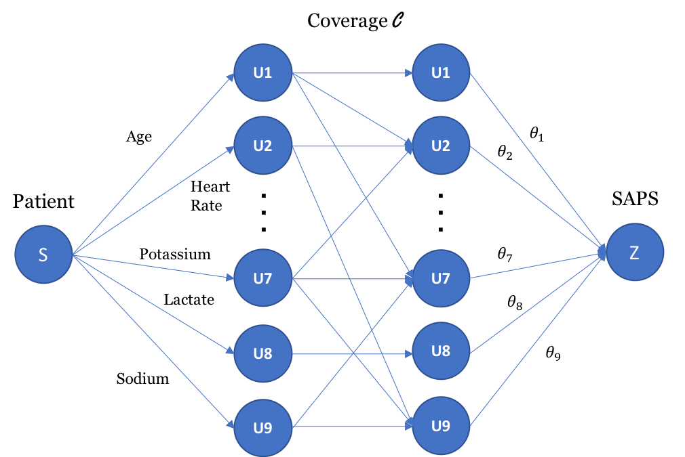

# Learning to Rank Patients Severity of Illness with Partially Observable Data

Harvard AM221 "Advanced Optimization" Final Project, Spring 2019

Medical care resources are always scarce, especially in the settings of emergent and critical care. How to accurately evaluate and rank severity of illness of patients at any point of time during hospital stay and effectively allocate limited medical resources is a challenging task. Also, in many situations, practitioners have to make decisions when some critical physiological indices are not able to be measured in real time, i.e., only partial data is observable. In this project, we formulate the ranking of severity of illness of ICU patients into ***Maximum Coverage*** problem with cardinality constraint, and leverage the framework of ***Distributional Optimization from Samples (DOPS)*** and ***Structured Ranking Support Vector Machine*** to solve this optimization problem. Our method achieves about 80 percent ranking accuracy when only 9 basic measurements are accessible, which indicates its potential application in healthcare domain.

Please refer to our [poster](paper/poster.pdf) and [paper](paper/final_report.pdf) for details.